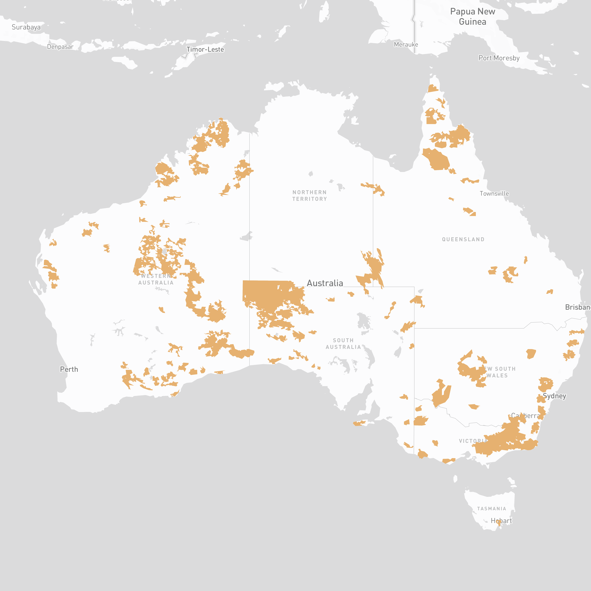
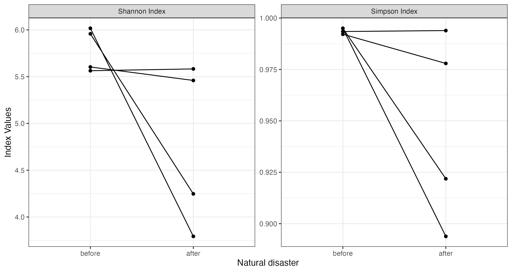

<!-- README.md is generated from README.Rmd. Please edit that file -->

```{r, include = FALSE}
knitr::opts_chunk$set(
  collapse = TRUE,
  comment = "#>"
)
```

# Disaster & Diversity 


## Methods

We create a data pipeline to compute biodiversity indexes (Shannon Index and Simpson Index) for historical bushfire regions in Australia. The pipeline includes functionalities to:

  - Find the shape file for the postcode in the disaster data: `disaster_as_shape()`
  - Query species from the Atlas of Living Australia: `query_species()`
  - Split the occurrence data by year and month: `split_time()`
  - Calculate indexes from the biodiversity data: `calculate_idx()`
  - Plot calculated indexes: `autoplot()`

## Results

From the historical bushfire regions, we find two types of changes in biodiversity indexes before and after the bushfire events, where some regions the Shannon index changes from 6 to less than 4.5 and the Simpsons index changes from 0.99 to less than 0.9.

 

## Team members: 

 - **Sherry Zhang**, Monash University: https://github.com/huizezhang-sherry
 - **Roben Delos Reyes**, The University of Melbourne: https://github.com/rddelosreyes
 - **Bernadette Hyland-Wood**, QUT: https://github.com/BernHyland
 - **John Lyons**, QUT: https://github.com/cakesy
 - **Alex Qin**, University of Sydney: https://github.com/alexrunqin
 
