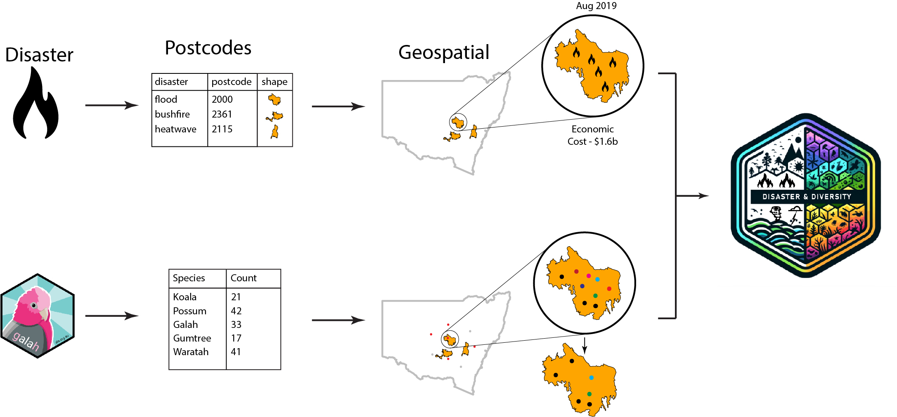

<!-- README.md is generated from README.Rmd. Please edit that file -->

# UNDatathon

## Methods

## Results

Team members:

- Sherry Zhang, Monash University:
  <https://github.com/huizezhang-sherry>
- Roben Delos Reyes, The University of Melbourne:
  <https://github.com/rddelosreyes>
- Bernadette Hyland-Wood, QUT: <https://github.com/BernHyland>
- John Lyons, QUT: <https://github.com/cakesy>
- Alex Qin, University of Sydney: <https://github.com/alexrunqin>

## References:

- UN Statistics Wiki:
  <https://unstats.un.org/wiki/display/UNDatathon2023/UN+Datathon+Theme>
- Atlas of Living Australia: <https://www.ala.org.au/>
- The galah pkg: <https://galah.ala.org.au/>
- A get-started example:
  <https://github.com/rfordatascience/tidytuesday/tree/master/data/2023/2023-03-07>
- A list of Australian animals:
  <https://trishansoz.com/trishansoz/animals/australian-animals.html>
- UN biodiversity map: <https://map.unbiodiversitylab.org/>
- Natural Hazards Research Australia:
  <https://www.naturalhazards.com.au>
- Measuring biodiversity index
  <https://www.coastalwiki.org/wiki/Measurements_of_biodiversity#Margalef.E2.80.99s_diversity_index.5B5.5D>
- Rapid assessment of the biodiversity impacts of the 2019–2020
  Australian megafires to guide urgent management intervention and
  recovery and lessons for other regions, Legge, S., Woinarski, J. C.
  Z., Scheele, B. C., Garnett, S. T., Lintermans, M., Nimmo, D. G.,
  Whiterod, N. S., Southwell, D. M., Ehmke, G., Buchan, A., Gray, J.,
  Metcalfe, D. J., Page, M., Rumpff, L., van Leeuwen, S., Williams, D.,
  Ahyong, S. T., Chapple, D. G., Cowan, M., … Tingley, R. (2022).
  Diversity and Distributions, 28, 571–591.
  <https://doi.org/10.1111/ddi.13428>
- Methodological approaches and challenges to assess the environmental
  losses from natural disasters
  <https://doi.org/10.1016/j.ijdrr.2020.101619>
- Impacts of the Unprecedented 2019-2020 Bushfires on Australian
  Animals, November 2020
  <https://assets.wwf.org.au/image/upload/v1674690976/website-media/resources/WWF_Impacts-of-the-unprecedented-2019-2020-bushfires-on-Australian-animals.pdf>
- Use of expert knowledge to elicit population trends for the koala
  (Phascolarctos cinereus) <https://doi.org/10.1111/ddi.12400>
- Biodiversity: what it is and why we need to care, Wall, K (2022)
  <https://www.ifaw.org/people/opinions/biodiversity-why-we-need-to-care>
